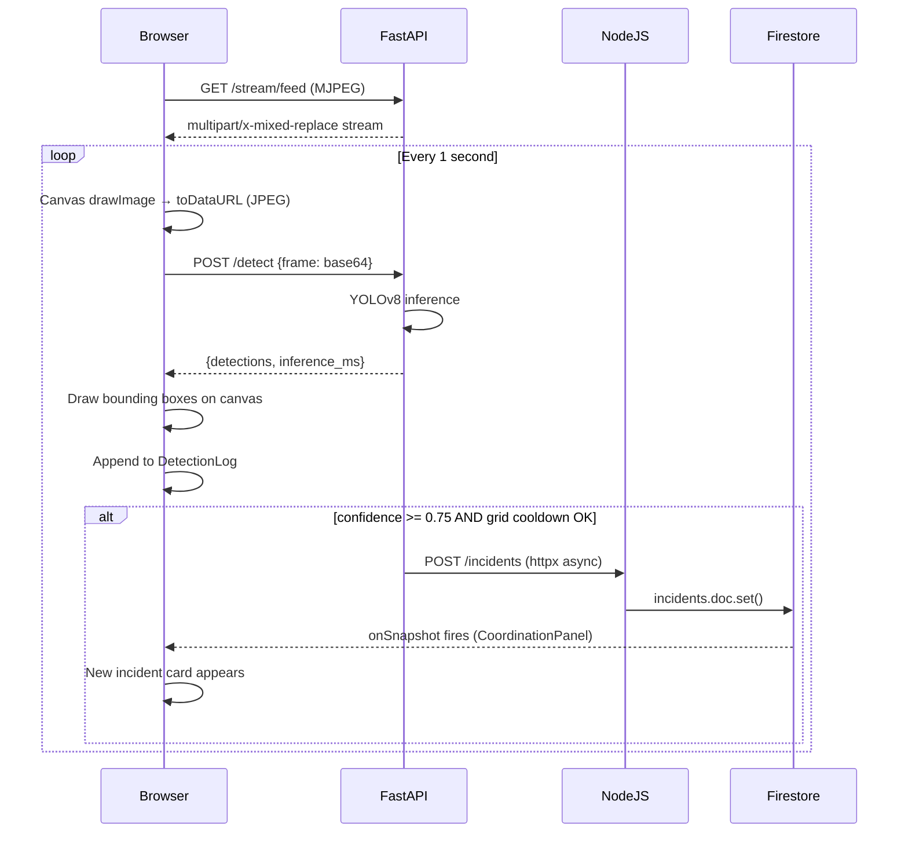
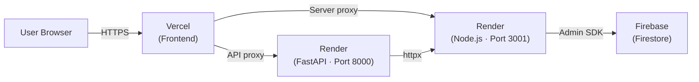

# RescueEye — System Architecture

## Component Diagram

```mermaid
graph TB
  subgraph Frontend ["Frontend (React + Vite + TypeScript)"]
    L[Login]
    D[Dashboard]
    M[Damage Map]
    C[Coordination Panel]
    E[Evaluation Report]
  end

  subgraph FastAPI ["Detection API (FastAPI · Port 8000)"]
    ST[/stream/feed — MJPEG]
    DT[/detect — YOLOv8 inference]
    CL[/classify — damage classification]
    MS[/models/status]
    LG[/logs/summary]
  end

  subgraph NodeJS ["App Server (Node.js + Express · Port 3001)"]
    AU[/auth — login / token verify]
    TM[/teams — CRUD + assign]
    IN[/incidents — CRUD + resolve]
    MG[/messages — threaded comms]
    DR[/drill — session management]
    EV[/evaluation — report export]
  end

  subgraph AI ["AI Models (YOLOv8 · CPU inference)"]
    YV[YOLOv8n — Victim Detection]
    YD[YOLOv8n-cls — Damage Classification]
  end

  subgraph Data ["Data Layer"]
    MP4[Simulated MP4 Feed / RTSP]
    SARD[SARD + VisDrone + WiSARD]
    FN[FloodNet + AIDER]
    FS[(Firebase Firestore)]
    JSONL[inference_log.jsonl]
  end

  D -->|MJPEG img tag| ST
  D -->|POST base64 frame| DT
  D -->|GET model pills| MS
  DT -->|runs| YV
  CL -->|runs| YD
  ST -->|reads| MP4
  YV -.->|trained on| SARD
  YD -.->|trained on| FN
  DT -->|conf≥0.75 httpx| IN
  DT -->|append| JSONL
  C -->|GET/PATCH| TM
  C -->|GET/POST| IN
  C -->|GET/POST| MG
  C -->|onSnapshot| FS
  TM -->|sync| FS
  IN -->|sync| FS
  MG -->|sync| FS
  AU -->|verify token| FS
  EV -->|reads| JSONL
```

## Detection Data Flow



## Deployment Architecture


